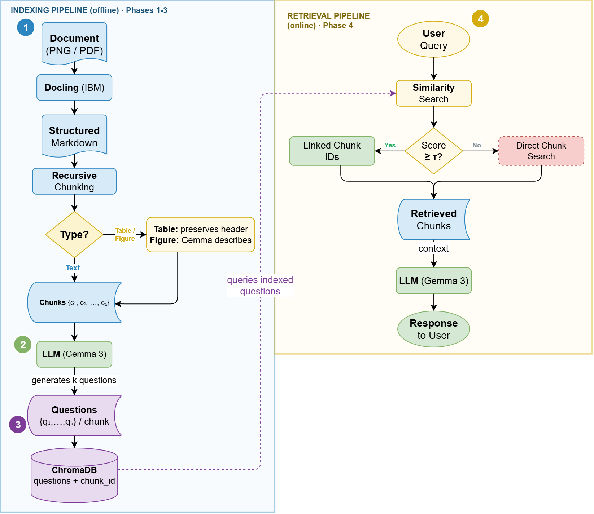

# QI-RAG Prompts

Reproducibility companion for **"Chunking Strategies for Retrieval in Enterprise Documents: A Comparative Study and the QI-RAG Proposal"**.

**Authors:** Maryane de Castro Lima¹, Thomaz Maia de Almeida²
¹ Instituto Federal de Educação, Ciência e Tecnologia do Ceará (IFCE)
² Núcleo de Visão Computacional e Engenharia (NUVEN)
Contact: maryane.castro@sti.ufc.br, thomaz.maia@ifce.edu.br

## About

**Question-Indexed RAG (QI-RAG)** is motivated by the semantic gap between the
colloquial language of user queries and the technical, formal language of enterprise
documents. Instead of indexing document chunks directly, QI-RAG indexes
*LLM-generated questions* about each chunk, bringing the search space closer to real
user queries. It operates in four phases (Sections 3.4.1–3.4.4 of the paper):

1. **Chunking and type detection** — documents are split via recursive chunking
   (800-character chunks, 200-character overlap), and each resulting chunk is
   classified as textual, tabular, or figure. Table headers are replicated across
   split segments so any retrieved slice stays interpretable; figure chunks get an
   LLM-generated textual description, treated as an additional chunk.
2. **Question generation** — Gemma 3 generates at least 5 semantically diverse
   questions per chunk (covering definitions, numerical values, comparisons, and
   process descriptions), with the prompt adapted to the chunk's type (textual,
   tabular, or figure description).
3. **Question indexing** — each generated question is embedded (BGE-M3 or Nomic
   Embed v1.5) and stored in ChromaDB with a pointer back to its source chunk. This
   separates the *search index* (questions, colloquial language) from the *answer
   repository* (chunks, technical language).
4. **Hybrid retrieval with fallback** — the user query is embedded and compared
   against the indexed questions by cosine similarity. If the top match reaches
   τ = 0.75, the 4 most similar questions' linked source chunks are returned as
   context; otherwise, the pipeline falls back to a direct similarity search over
   the original chunk collection.

This repository publishes the actual prompt templates (Gemma 3) used to run that
pipeline — figure description (phase 1), question generation (phase 2, per chunk
type), final answer synthesis, the GEval correctness judge, and the GEval
retrieval-accuracy judge — since the paper itself describes prompt *behavior* but not
the literal prompt text.

See [`prompt.md`](./prompt.md) for the full set of prompts and implementation notes.

## Generation Parameters

The same configuration was used across all LLM calls in the pipeline (Gemma 3
question/description/answer generation and the GPT-OSS 120B GEval judges), unless
noted otherwise in `prompt.md`:

| Parameter | Value |
|---|---|
| Temperature | 0.5 |
| top-k | default (not overridden) |
| top-p | default (not overridden) |
| max_tokens | unlimited (no cap set) |

## Citation

BibTeX entry to be added once the camera-ready proceedings citation (venue, year,
pages, DOI) is finalized.

## License

Released under the [MIT License](./LICENSE).
